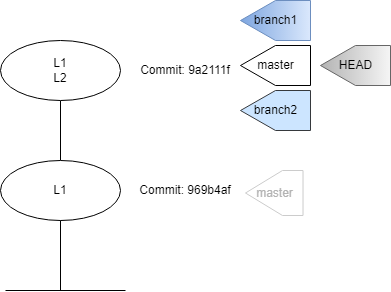
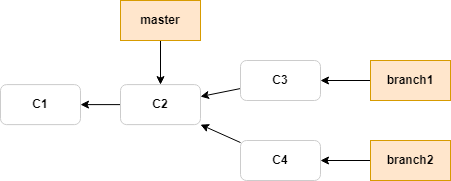
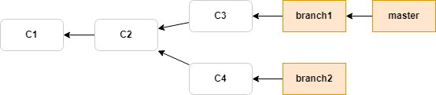
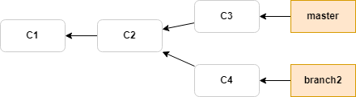

# Git Introduction - Branching and Merging

## main branch & HEAD pointer


Above commit graph shows a new repo with 2 commits.\
Every commit has a SHA1 hash.\
By default, git creates the first branch known as the _master_ or _main_ branch.\
A branch is just a pointer to a SHA1 hash. i.e. a branch is a pointer to a commit.\
When you are on the master branch, every time you make a commit, the branch moves up to the latest commit.\
The way git know what branch we are on is a special pointer called _HEAD_.\
_HEAD_ is a pointer that points to a branch and not directly to the commit. It is also known as symbolic pointer.\
_HEAD_ pointer tells us what we have checked out. In above image, it tells us that we have _master_ branch checked out.

`git log` shows commit history.

```
$ alias graph="git log --all --decorate --oneline --graph"
$ graph
* 9a2111f (HEAD -> master) add L2
* 969b4af add L1
```
---
## Create New Branches
Branching means you diverge from the main line of development and continue to do work without messing with that main line.



`git branch <branch-name>` creates a new branch.\
 Branch gets instantiated where the _HEAD_ pointer is.\
 `git branch` shows all branches.

```
$ git branch branch1
$ git branch branch2
$ git branch
  branch1
  branch2
* master
```
_Asterisk *_ next to the branch name tells us what branch is checked out. From the above output, _master_ branch is checked out. i.e. _HEAD_ pointer is pointing to the _master_ branch.

Using graph alias, we see that all 3 branches are pointing to the same commit. _HEAD_ is attached to the _master_ since we have _master_ checked out.
```
$ graph
* 9a2111f (HEAD -> master, branch2, branch1) add L2
* 969b4af add L1
```
---
## Switching Branches

`git checkout <branch-name>` switches to an existing branch with name `branch-name`. i.e. it moves the _HEAD_ pointer to point to the branch with name `<branch-name>`.

```
$ git checkout branch1
Switched to branch 'branch1'

$ graph
* 9a2111f (HEAD -> branch1, master, branch2) add L2
* 969b4af add L1

$ git status
On branch branch1
```

>**Creating a new branch and switching to it at the same time.**
>* It’s typical to create a new branch and to switch to that new branch at the same time — this can be done in one operation with `git checkout -b <newbranchname>`.
>
>* From Git version 2.23 onwards you can use `git switch` instead of `git checkout` to:
>   * Switch to an existing branch: `git switch testing-branch`.
>   * Create a new branch and switch to it: `git switch -c new-branch`. The `-c` flag stands for create, you can also use the full flag: `--create`.
>   * Return to your previously checked out branch: `git switch -`.
>
>
>When you switch branches, Git resets your working directory to look like it did the last time you committed on that branch. It adds, removes, and modifies files automatically to make sure your working copy is what the branch looked like on your last commit to it.

If you edit any file in this branch and commit the changes, only this branch will move up to the new commit. Other branches, including main/master, will stay at the previous commit. This is shown below.


If you run `git log --oneline --decorate --graph --all` it will print out the history of your commits, showing where your branch pointers are and how your history has diverged.
```
$ git add L1.txt | git commit -m "Edit L1 in branch1"
[branch1 e1b738c] Edit L1 in branch1
 1 file changed, 2 insertions(+), 1 deletion(-)

/c/DATA/Git/myproject (branch1)
$ graph
* e1b738c (HEAD -> branch1) Edit L1 in branch1
* 9a2111f (master, branch2) add L2
* 969b4af add L1
```

Note that the changes made to the file are only in the branch that was checked out.
```
$ cat L1.txt
Apples
Oranges
Water
Added in branch1

/c/DATA/Git/myproject (branch1)
$ git checkout branch2
Switched to branch 'branch2'

/c/DATA/Git/myproject (branch2)
$ cat L1.txt
Apples
Oranges
Water
```

`graph` shows checkout moves the _HEAD_ pointer.
```
$ graph
* e1b738c (branch1) Edit L1 in branch1
* 9a2111f (HEAD -> branch2, master) add L2
* 969b4af add L1
```

Now, any changes made to L1 will remain in branch2. Note the output from `graph` as well.


```
/c/DATA/Git/myproject (branch2)
$ git add L1.txt | git commit -m "Edit L1 in branch2"
[branch2 e33af44] Edit L1 in branch2
 1 file changed, 2 insertions(+), 1 deletion(-)

/c/DATA/Git/myproject (branch2)
$ graph
* e33af44 (HEAD -> branch2) Edit L1 in branch2
| * e1b738c (branch1) Edit L1 in branch1
|/
* 9a2111f (master) add L2
* 969b4af add L1
```
---
## Merging

Check out the branch you wish to merge into and then run the `git merge` command.\
Below is the current state of commits.



### Fast-forward Merge

This is used when there is a direct path from `master` to the other branch.
E.g. `git diff master..dev` shows what will change when we merge `dev` branch into `master` branch.

Let's say we want to merge the changes from `branch1` into `master` branch.\
Because the commit `C3` pointed to by the branch `branch1` is directly ahead of the commit `C2` you’re on (as indicated by _HEAD_ pointer), Git simply moves the pointer forward.

```
/c/DATA/Git/myproject (master)
$ git checkout master
Already on 'master'

/c/DATA/Git/myproject (master)
$ git merge branch1
Updating 9a2111f..e1b738c
Fast-forward
 L1.txt | 3 ++-
 1 file changed, 2 insertions(+), 1 deletion(-)
```



Now the changes from `branch1` are in the `master` branch. We can delete `branch1` since it is no longer needed. You can delete it with the `-d` option to `git branch`.

```
/c/DATA/Git/myproject (master)
$ git branch -d branch1
Deleted branch branch1 (was e1b738c).

$ graph
* e33af44 (branch2) Edit L1 in branch2
| * e1b738c (HEAD -> master) Edit L1 in branch1
|/
* 9a2111f add L2
* 969b4af add L1
```



### Three-way Merge

This is used when there is not a direct path from the `master` branch to the other branch.
Git cannot do a fast-forward merge in this case.
After `git merge <branch-name>`, resolve conflicts manually. Then do `git add <file>`. Then do `git commit`.

A **merge conflict** occurs when we try to merge branches that have changed the same lines in the same files.
