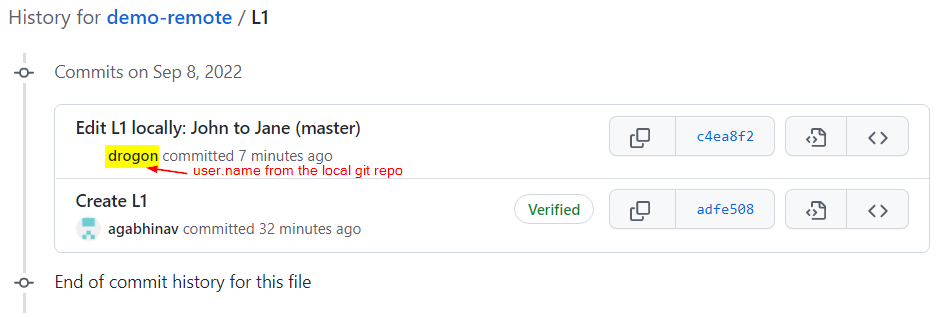
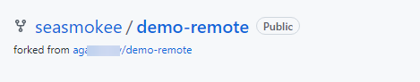
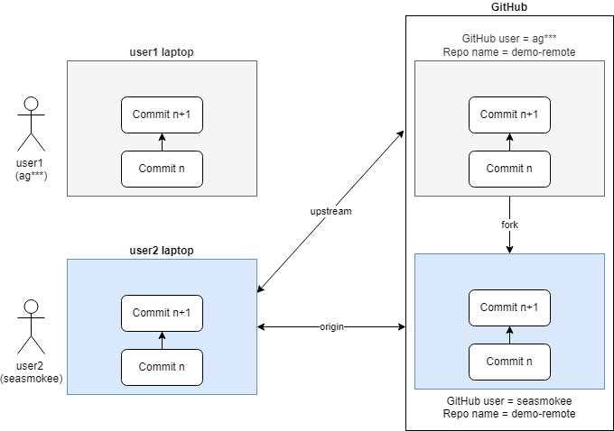

# Introduction to Git - Remotes

What is a `Git Remote`? A remote repository in Git, also called a `remote`, is a Git repository that’s hosted on the Internet or another network.

## git clone
Create a repo on `github`. This is the remote repository.\
Use `git clone <url>` to download the repo. i.e. retrieve a copy of this repo to your local system.

You can setup `user.name` and `user.email` specifically for this repo as shown below.

```
$ git config --local user.name "drogon"
$ git config --local user.email "drogon@mail"
```

## git remote
The command `git remote` displays the remotes. After cloning a repo, `origin` is the default name for the first remote. `-v` option shows the full locations.
```
/c/DATA/Git/demo-remote (master)
$ git remote
origin

$ git remote -v
origin  https://github.com/agabhinav/demo-remote.git (fetch)
origin  https://github.com/agabhinav/demo-remote.git (push)
```

Run the `graph` command
```
$ graph
* e773139 (HEAD -> master, origin/master, origin/HEAD) Initial commit
```
Observations from this output:
* This repo has a single commit in its commit history.
* Locally, there is only a `master` branch that points to that single commit.
* `HEAD` pointer tells us that we have `master` branch checked out.
* `origin/master` is a specialized branch. It is called a _remote tracking branch_. 
It tells what the master branch looks like at origin (i.e. in github). In this example, it tells us that our local `master` branch and the `master` branch in github are pointing to the same commit. i.e. our local repo is in sync with our remote named origin.

## git fetch and git merge
**Use-case** Add a new file in the remote repo and then download those changes to the local repo.

Add a new file _L1_ to the repo on github.
```json
{"employees":[
  { "firstName":"John", "lastName":"Doe" },
  { "firstName":"Anna", "lastName":"Smith" },
  { "firstName":"Peter", "lastName":"Jones" }
]}
```
Git on the local system doesn't know about the commit at the origin (i.e. on github).\
`git fetch origin` reaches out to github and downloads any new commits.

```
$ git fetch origin
remote: Enumerating objects: 4, done.
remote: Counting objects: 100% (4/4), done.
remote: Compressing objects: 100% (3/3), done.
remote: Total 3 (delta 0), reused 0 (delta 0), pack-reused 0
Unpacking objects: 100% (3/3), 721 bytes | 15.00 KiB/s, done.
From https://github.com/agabhinav/demo-remote
   e773139..adfe508  master     -> origin/master

$ git status
On branch master
Your branch is behind 'origin/master' by 1 commit, and can be fast-forwarded.
  (use "git pull" to update your local branch)

$ graph
* adfe508 (origin/master, origin/HEAD) Create L1
* e773139 (HEAD -> master) Initial commit
```
Observations from this output:
*  There are 2 commits.
* At `origin`, `master` branch is at the 2nd commit.
* Locally, `master' branch is still at the 1st commit.
* After running `git fetch origin`, the remote tracking branch `origin/master` moves to the 2nd commit in local repo.

Use `git merge` to integrate or merge the changes from `origin/master` into the local `master` branch. Merge the commit referenced by `origin/master` into the local `master` branch.

```
$ git merge origin/master
Updating e773139..adfe508
Fast-forward
 L1 | 5 +++++
 1 file changed, 5 insertions(+)
 create mode 100644 L1

$ ls
L1  README.md

 $ git status
On branch master
Your branch is up to date with 'origin/master'.

nothing to commit, working tree clean

$ graph
* adfe508 (HEAD -> master, origin/master, origin/HEAD) Create L1
* e773139 Initial commit
 ```
Observations from this output:
* _L1_ file is now in the working tree.
* `graph` command shows that the local repo is in sync with the remote. i.e. the local `master` branch and the `origin/master` branch are at the same commit.

## git pull
`git pull` combines git fetch and git merge in a single command.

## git push

**Use-case** Make a local change and push it to the origin.

Edit the local file _L1_.
```json
{"employees":[
  { "firstName":"Jane", "lastName":"Doe" },
  { "firstName":"Anna", "lastName":"Smith" },
  { "firstName":"Peter", "lastName":"Jones" }
]}
```
Commit the changes to the local repo.
```
$ git commit -a -m "Edit L1 locally: John to Jane (master)"
[master c4ea8f2] Edit L1 locally: John to Jane (master)
 1 file changed, 1 insertion(+), 1 deletion(-)
```

`graph` command shows that locally we are one commit ahead of the tracking branch `origin/master`.
```
$ graph
* c4ea8f2 (HEAD -> master) Edit L1 locally: John to Jane (master)
* adfe508 (origin/master, origin/HEAD) Create L1
* e773139 Initial commit

$ git status
On branch master
Your branch is ahead of 'origin/master' by 1 commit.
  (use "git push" to publish your local commits)

nothing to commit, working tree clean
```

`git push origin master` pushes the local changes to the remote named `origin`, into the `master` branch at `origin`. This push relies on github authentication.

```
$ git push origin master
Enumerating objects: 5, done.
Counting objects: 100% (5/5), done.
Delta compression using up to 8 threads
Compressing objects: 100% (3/3), done.
Writing objects: 100% (3/3), 315 bytes | 105.00 KiB/s, done.
Total 3 (delta 1), reused 0 (delta 0), pack-reused 0
remote: Resolving deltas: 100% (1/1), completed with 1 local object.
To https://github.com/agabhinav/demo-remote.git
   adfe508..c4ea8f2  master -> master
```

`graph` alias now shows that the tracking branch is updated.
```
$ graph
* c4ea8f2 (HEAD -> master, origin/master, origin/HEAD) Edit L1 locally: John to Jane (master)
* adfe508 Create L1
* e773139 Initial commit
```
Note the `user.name` in the commit history on github.


---

## Create a GitHub fork

**Use case** Let's say you want to work on someone else's repo in github. You don't have write access to that repo. You can create a fork of that repo. A fork creates a copy of a repo in github. You can then close this copy.

For this demo, I'll use two github accounts.\
1 - used above to create demo-remote repo\
2 - seasmokee

Login to GitHub as the 2nd account and go to the demo-remote repo from 1st account.\
Click on the `fork` button in GitHub. This will create a fork of the repo in the 2nd account as shown below.



Now you can `clone` this forked repo.\
(Optional) After cloning, you can set the local `user.name` and `user.email` as shown below.
```
$ git clone https://github.com/seasmokee/demo-remote.git
$ git config --local user.name "seasmokee"
$ git config --local user.email "seasmokee@mail"
```

Use `git remote -v` to view the git remotes. Note that `origin` points to the forked repo in GitHub.
```
$ git remote -v
origin  https://github.com/seasmokee/demo-remote.git (fetch)
origin  https://github.com/seasmokee/demo-remote.git (push)
```
## Add a Git remote

So far from the 2nd user's perspective, `origin` points to the forked repo.\
We can add a second git remote `upstream` to point to the original repo in GitHub. This will be useful to stay in sync with the original repo in GitHub.



To add a git remote, use `git remote add` command.\
`git remote add <name/alias> <url>` adds a remote called `<name/alias>` to the repo pointed by the `<url>`.

`git remote -v` will now show two remotes.
```
/c/DATA/Git/seasmokee/demo-remote (master)
$ git remote add upstream https://github.com/agabhinav/demo-remote.git

$ git remote -v
origin  https://github.com/seasmokee/demo-remote.git (fetch)
origin  https://github.com/seasmokee/demo-remote.git (push)
upstream        https://github.com/agabhinav/demo-remote.git (fetch)
upstream        https://github.com/agabhinav/demo-remote.git (push)
```

`git remote remove <remote name>` can be used to remove a remote.

Note that you don't have a remote tracking branch for this new remote upstream.
```
$ graph
* c4ea8f2 (HEAD -> master, origin/master, origin/HEAD) Edit L1 locally: John to Jane (master)
* adfe508 Create L1
* e773139 Initial commit
```

Use `git fetch` to fix this.
```
$ git fetch upstream
From https://github.com/agabhinav/demo-remote
 * [new branch]      master     -> upstream/master

/c/DATA/Git/seasmokee/demo-remote (master)
$ graph
* c4ea8f2 (HEAD -> master, upstream/master, origin/master, origin/HEAD) Edit L1 locally: John to Jane (master)
* adfe508 Create L1
* e773139 Initial commit
```

## Sync with upstream
**Use case** Keep user2's local repo and its fork in sync with upstream in case there are any changes in the upstream.

Add a new file to user1's repo and push it to upstream.

```
$ git commit -a -m "add L2 in user1 local repo"

$ git push origin master

$ graph
* 1f02b7b (HEAD -> master) add L2 in user1 local repo
* c4ea8f2 (origin/master, origin/HEAD) Edit L1 locally: John to Jane (master)
* adfe508 Create L1
* e773139 Initial commit
```

user2 won't see this commit till user2 runs `git fetch`
```
$ graph
* 1f02b7b (upstream/master) add L2 in user1 local repo
* c4ea8f2 (HEAD -> master, origin/master, origin/HEAD) Edit L1 locally: John to Jane (master)
* adfe508 Create L1
* e773139 Initial commit
```

User `git merge` to merge the changes.
```
$ git merge upstream/master
Updating c4ea8f2..1f02b7b
Fast-forward
 L2 | 5 +++++
 1 file changed, 5 insertions(+)
 create mode 100644 L2
 ```
 Now, local `master` is at the new commit from `upstream/master`.\
 user2's fork (origin/master) is still at the old commit as shown below.
 ```
 $ graph
* 1f02b7b (HEAD -> master, upstream/master) add L2 in user1 local repo
* c4ea8f2 (origin/master, origin/HEAD) Edit L1 locally: John to Jane (master)
* adfe508 Create L1
* e773139 Initial commit
```

Use `git push` to bring user2's fork in sync with the local master.

