# Git Introduction - Core Concepts

## References
[Pro Git Book by Scott Chacon and Ben Straub](https://git-scm.com/book/en/v2)  
[A Visual Git Reference by Mark Lodato](https://marklodato.github.io/visual-git-guide/index-en.html)  
[Introduction to Git - Core Concepts by David Mahler](https://youtu.be/uR6G2v_WsRA)  
[Introduction to Git - Branching and Merging by David Mahler](https://youtu.be/FyAAIHHClqI) 

Git = version control system (VCS).  

## Sample use-cases
* Take snapshots of files over time.  
* Restore earlier versions of files from snapshots.  
* Work on multiple versions of a file in parallel.  

---

## Git commit graph
Git tracks changes to files over time using snapshots that you can take at any time.  
These snapshots are called commits.  
Git commit graph shows the history of commits.

---

## 3  areas of a Git repo

* Working Tree\
What you see on the file system.\
You add, remove, and edit files in the working tree.

* Staging Area (Index)

* History\
Equivalent to the commit graph.  
Kept in a hidden .git directory.  
---
## Create a git repo
1. Create a directory on your file system. This will become git repo's working tree.
    ```
    $ mkdir myproject
    ```

    Add a file L1 to this directory.
    ```
    Apples
    Oranges
    ```

2. Turn that directory into a git repo using `git init` 
    ```
    $ git init
    Initialized empty Git repository in C:/DATA/Git/myproject/.git/
    ```

3. Note that we haven't made any commit so far. i.e. the file we added to the working tree is untracked and not yet in the staging area.

    Set your username and email before making a commit.  
    List current configuration using `git config`
    ```
    $ git config --list
    ...
    user.name=username
    user.email=email
    ...
    ```

    Set your account's default global identity.  
    `--global` means that the provided name and email will be used for any git repo on this system.  
    Use `--local` flag if you wan't to use a different name and email for a particular repo.

    ```
    $ git config --global user.email "you@example.com"
    $ git config --global user.name "Your Name"
    ```
---
## Git commit

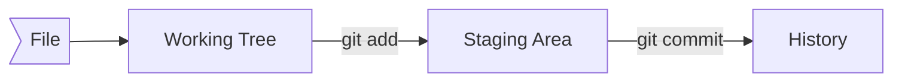
\
Use `git status` to view the state of files in the working tree and the staging area.

```
$ git status
On branch master

No commits yet

Untracked files:
  (use "git add <file>..." to include in what will be committed)
        L1.txt

nothing added to commit but untracked files present (use "git add" to track)
```

`git add` - add file to staging area and start tracking the file.\
`git add .` adds all new and modified files to the staging area.
```
$ git add L1.txt

$ git status
On branch master

No commits yet

Changes to be committed:
  (use "git rm --cached <file>..." to unstage)
        new file:   L1.txt
```

`git commit -m "commit message"` - create a commit with whatever is in the staging area.
```
$ git commit -m "add file L1"
[master (root-commit) 97065ac] add file L1
 1 file changed, 2 insertions(+)
 create mode 100644 L1.txt
 ```
 Every commit gets a unique hash value. _97065ac_ above.

If you just use `git commit` without `-m` option, then it'll open your default text editor where you can provide multi-line comments for the commit. 
```
$ git status
On branch master
nothing to commit, working tree clean
```
---
## Viewing commit graph
`git log` shows commit graph.

```
$ git log
commit 97065ac725e0e6b8687f32747a2bf489c37aa4d8 (HEAD -> master)
Author: Abhinav <agabhinav@users.noreply.github.com>
Date:   Wed Sep 7 15:08:24 2022 -0500

    add file L1
```

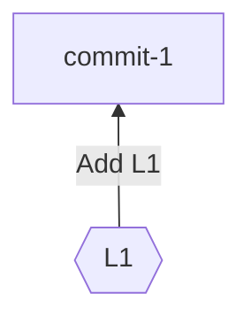

Create a new file L2 and edit L1.
```
$ L2 - new file
Apples
Bread
Peaches

$ L1 - add Water
Apples
Oranges
Water
```

`git status` shows the following.
```
$ git status
On branch master
Changes not staged for commit:
  (use "git add <file>..." to update what will be committed)
  (use "git restore <file>..." to discard changes in working directory)
        modified:   L1.txt

Untracked files:
  (use "git add <file>..." to include in what will be committed)
        L2.txt

no changes added to commit (use "git add" and/or "git commit -a")
```

`git diff` shows difference between tracked files in the working tree and the staging area.


```
$ git diff
diff --git a/L1.txt b/L1.txt
index 92e89b1..b8fd882 100644
--- a/L1.txt
+++ b/L1.txt
@@ -1,2 +1,3 @@
 Apples
 Oranges
+Water
\ No newline at end of file
```

```
$ git add .
$ git status
On branch master
Changes to be committed:
  (use "git restore --staged <file>..." to unstage)
        modified:   L1.txt
        new file:   L2.txt
```

`git diff --staged` shows diff between the staging area and the most recent commit. i.e. it shows what we are about to commit.


```
$ git diff --staged
diff --git a/L1.txt b/L1.txt
index 92e89b1..b8fd882 100644
--- a/L1.txt
+++ b/L1.txt
@@ -1,2 +1,3 @@
 Apples
 Oranges
+Water
\ No newline at end of file
diff --git a/L2.txt b/L2.txt
new file mode 100644
index 0000000..58518a5
--- /dev/null
+++ b/L2.txt
@@ -0,0 +1,3 @@
+Apples
+Bread
+Peaches
\ No newline at end of file
```

View **commit graph** using `git log`

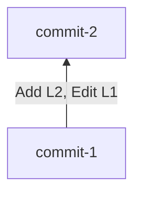

```
$ git log
commit 410cffa1b7c4bfe93bbaf6ccd3488fef2a353da4 (HEAD -> master)
Author: Abhinav <agabhinav@users.noreply.github.com>
Date:   Wed Sep 7 15:36:50 2022 -0500

    add L2 and edit L1

commit 97065ac725e0e6b8687f32747a2bf489c37aa4d8
Author: Abhinav <agabhinav@users.noreply.github.com>
Date:   Wed Sep 7 15:08:24 2022 -0500

    add file L1
```
---
## Remove a file in Git

`git rm <file>` removes the file from the working tree and also stages this removal.

```
$ git rm L2.txt
rm 'L2.txt'

$ git status
On branch master
Changes to be committed:
  (use "git restore --staged <file>..." to unstage)
        deleted:    L2.txt
```

Below is the **commit graph** after commiting the changes.

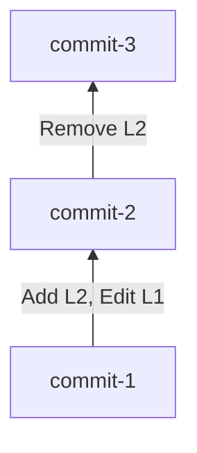

```
$ git log
commit dac9d0846f33d8e91e5b5363697626784c4245e0 (HEAD -> master)
Author: Abhinav <agabhinav@users.noreply.github.com>
Date:   Wed Sep 7 15:51:29 2022 -0500

    Delete L2

commit 410cffa1b7c4bfe93bbaf6ccd3488fef2a353da4
Author: Abhinav <agabhinav@users.noreply.github.com>
Date:   Wed Sep 7 15:36:50 2022 -0500

    add L2 and edit L1

commit 97065ac725e0e6b8687f32747a2bf489c37aa4d8
Author: Abhinav <agabhinav@users.noreply.github.com>
Date:   Wed Sep 7 15:08:24 2022 -0500

    add file L1
```

---

## Undo working tree changes
Make some changes to L1.
```
Apples
Oranges
Water
bad data 1
bad data 2
```

`git checkout -- file` replaces the file in working tree with the previous version of the file from staging area, effectively discarding
the new working tree changes.\
`git restore <file>` does the same thing.

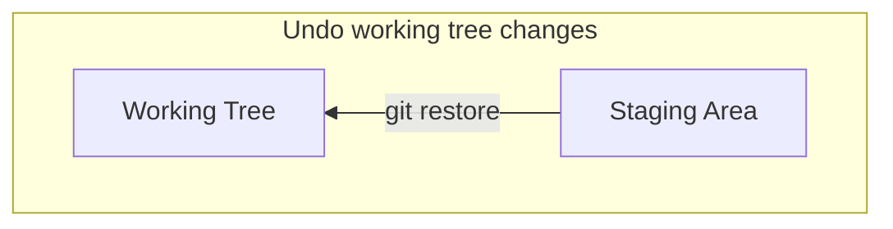

---

## Undo staging of files
Edit L1 and stage the change using `git add`
```
$ L1 - add more bad data
Apples
Oranges
Water
more bad data
```

```
$ git add L1.txt

$ git diff

$ git diff --staged
diff --git a/L1.txt b/L1.txt
index b8fd882..34fc5d3 100644
--- a/L1.txt
+++ b/L1.txt
@@ -1,3 +1,4 @@
 Apples
 Oranges
-Water
\ No newline at end of file
+Water
+more bad data
```

`git restore --staged <file>`\
`git reset HEAD <file>` does the same thing. i.e. it restores `<file>` from the latest commit. HEAD refers to the most recent commit.

```
$ git restore --staged L1.txt

$ git diff

$ git status
On branch master
nothing to commit, working tree clean
```

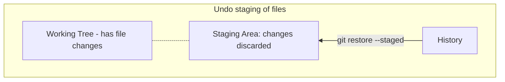

---

## Restore file from an earlier commit

`git checkout <commit-hash> -- <file>` restores the file from a specific commit into both the working tree and the staging area.

```
$ git log -- L2.txt
commit dac9d0846f33d8e91e5b5363697626784c4245e0 (HEAD -> master)
Author: Abhinav <agabhinav@users.noreply.github.com>
Date:   Wed Sep 7 15:51:29 2022 -0500

    Delete L2

commit 410cffa1b7c4bfe93bbaf6ccd3488fef2a353da4
Author: Abhinav <agabhinav@users.noreply.github.com>
Date:   Wed Sep 7 15:36:50 2022 -0500

    add L2 and edit L1

$ git checkout 410cff -- L2.txt

$ git status
On branch master
Changes to be committed:
  (use "git restore --staged <file>..." to unstage)
        new file:   L2.txt

$ git commit -m "restore L2.txt"
[master 85ec248] restore L2.txt
 1 file changed, 3 insertions(+)
 create mode 100644 L2.txt
```
---

## .gitignore

Create a `.gitignore` file in your git repo to specify the files you don't want git to track such as log files etc.

```
/c/DATA/Git/myproject (master)
$ touch myapp.tmp
$ mkdir logs
$ touch logs/log1.log
$ touch logs/log2.log

$ git status
On branch master
Untracked files:
  (use "git add <file>..." to include in what will be committed)
        logs/
        myapp.tmp

nothing added to commit but untracked files present (use "git add" to track)
```
If you don't want git to pay attention to these files,  create a `.gitignore` file.

```
*.tmp
logs/
```

Now, `git status` shows the following. Git is no longer tracking the files specified in `.gitignore` file.

```
$ git status
On branch master
Untracked files:
  (use "git add <file>..." to include in what will be committed)
        .gitignore

nothing added to commit but untracked files present (use "git add" to track)
```

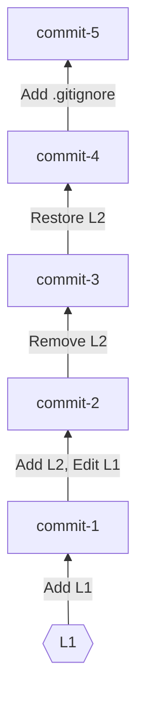
---

# Git Introduction - Branching and Merging

## main branch & HEAD pointer

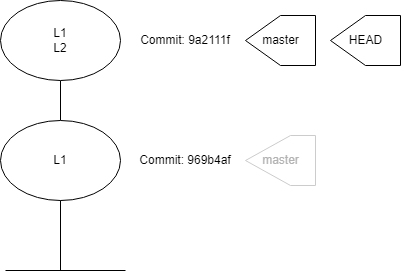

Above commit graph shows a new repo with 2 commits.\
Every commit has a SHA1 hash.\
By default, git creates the first branch known as the _master_ or _main_ branch.\
A branch is just a pointer to a SHA1 hash. i.e. a branch is a pointer to a commit.\
When you are on the master branch, every time you make a commit, the branch moves up to the latest commit.\
The way git know what branch we are on is a special pointer called _HEAD_.\
_HEAD_ is a pointer that points to a branch and not directly to the commit. It is also known as symbolic pointer.\
_HEAD_ pointer tells us what we have checked out. In above image, it tells us that we have _master_ branch checked out.

`git log` shows commit history.

```
$ alias graph="git log --all --decorate --oneline --graph"
$ graph
* 9a2111f (HEAD -> master) add L2
* 969b4af add L1
```
---
## Create New Branches
Branching means you diverge from the main line of development and continue to do work without messing with that main line.

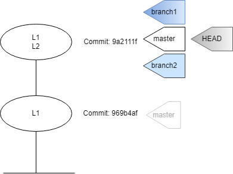

`git branch <branch-name>` creates a new branch.\
 Branch gets instantiated where the _HEAD_ pointer is.\
 `git branch` shows all branches.

```
$ git branch branch1
$ git branch branch2
$ git branch
  branch1
  branch2
* master
```
_Asterisk *_ next to the branch name tells us what branch is checked out. From the above output, _master_ branch is checked out. i.e. _HEAD_ pointer is pointing to the _master_ branch.

Using graph alias, we see that all 3 branches are pointing to the same commit. _HEAD_ is attached to the _master_ since we have _master_ checked out.
```
$ graph
* 9a2111f (HEAD -> master, branch2, branch1) add L2
* 969b4af add L1
```
---
## Switching Branches

`git checkout <branch-name>` switches to an existing branch with name `branch-name`. i.e. it moves the _HEAD_ pointer to point to the branch with name `<branch-name>`.

```
$ git checkout branch1
Switched to branch 'branch1'

$ graph
* 9a2111f (HEAD -> branch1, master, branch2) add L2
* 969b4af add L1

$ git status
On branch branch1
```

>**Creating a new branch and switching to it at the same time.**
>* It’s typical to create a new branch and want to switch to that new branch at the same time — this can be done in one operation with `git checkout -b <newbranchname>`.
>
>* From Git version 2.23 onwards you can use `git switch` instead of `git checkout` to:
>   * Switch to an existing branch: `git switch testing-branch`.
>   * Create a new branch and switch to it: `git switch -c new-branch`. The `-c` flag stands for create, you can also use the full flag: `--create`.
>   * Return to your previously checked out branch: `git switch -`.
>
>
>When you switch branches, Git resets your working directory to look like it did the last time you committed on that branch. It adds, removes, and modifies files automatically to make sure your working copy is what the branch looked like on your last commit to it.

If you edit any file in this branch and commit the changes, only this branch will move up to the new commit. Other branches, including main/master, will stay at the previous commit. This is shown below.

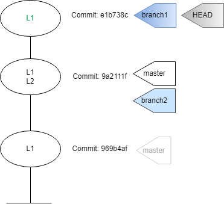

If you run `git log --oneline --decorate --graph --all` it will print out the history of your commits, showing where your branch pointers are and how your history has diverged.
```
$ git add L1.txt | git commit -m "Edit L1 in branch1"
[branch1 e1b738c] Edit L1 in branch1
 1 file changed, 2 insertions(+), 1 deletion(-)

/c/DATA/Git/myproject (branch1)
$ graph
* e1b738c (HEAD -> branch1) Edit L1 in branch1
* 9a2111f (master, branch2) add L2
* 969b4af add L1
```

Note that the changes made to the file are only in the branch that was checked out.
```
$ cat L1.txt
Apples
Oranges
Water
Added in branch1

/c/DATA/Git/myproject (branch1)
$ git checkout branch2
Switched to branch 'branch2'

/c/DATA/Git/myproject (branch2)
$ cat L1.txt
Apples
Oranges
Water
```

`graph` shows checkout moves the _HEAD_ pointer.
```
$ graph
* e1b738c (branch1) Edit L1 in branch1
* 9a2111f (HEAD -> branch2, master) add L2
* 969b4af add L1
```

Now, any changes made to L1 will remain in branch2. Note the output from `graph` as well.

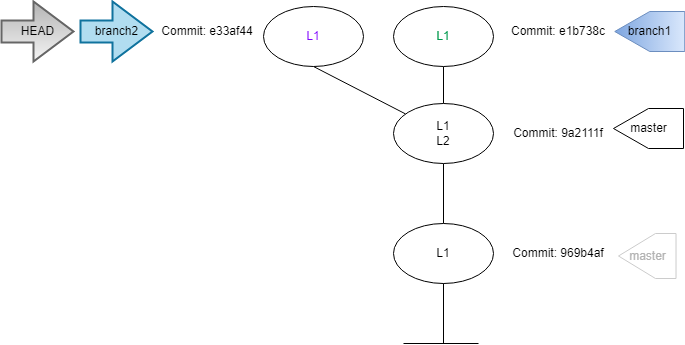

```
/c/DATA/Git/myproject (branch2)
$ git add L1.txt | git commit -m "Edit L1 in branch2"
[branch2 e33af44] Edit L1 in branch2
 1 file changed, 2 insertions(+), 1 deletion(-)

/c/DATA/Git/myproject (branch2)
$ graph
* e33af44 (HEAD -> branch2) Edit L1 in branch2
| * e1b738c (branch1) Edit L1 in branch1
|/
* 9a2111f (master) add L2
* 969b4af add L1
```
---
## Merging

Check out the branch you wish to merge into and then run the `git merge` command.\
Below is the current state of commits.


### Fast-forward Merge

This is used when there is a direct path from `master` to the other branch.
E.g. `git diff master..dev` shows what will change when we merge `dev` branch into `master` branch.

Let's say we want to merge the changes from `branch1` into `master` branch.\
Because the commit `C3` pointed to by the branch `branch1` is directly ahead of the commit `C2` you’re on (as indicated by _HEAD_ pointer), Git simply moves the pointer forward.

```
/c/DATA/Git/myproject (master)
$ git checkout master
Already on 'master'

/c/DATA/Git/myproject (master)
$ git merge branch1
Updating 9a2111f..e1b738c
Fast-forward
 L1.txt | 3 ++-
 1 file changed, 2 insertions(+), 1 deletion(-)
```

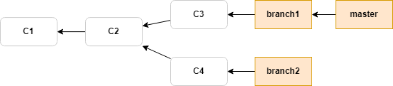

Now the changes from `branch1` are in the `master` branch. We can delete `branch1` since it is no longer needed. You can delete it with the `-d` option to `git branch`.

```
/c/DATA/Git/myproject (master)
$ git branch -d branch1
Deleted branch branch1 (was e1b738c).

$ graph
* e33af44 (branch2) Edit L1 in branch2
| * e1b738c (HEAD -> master) Edit L1 in branch1
|/
* 9a2111f add L2
* 969b4af add L1
```

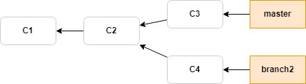

### Three-way Merge

This is used when there is not a direct path from the `master` branch to the other branch.
Git cannot do a fast-forward merge in this case.
After `git merge <branch-name>`, resolve conflicts manually. Then do `git add <file>`. Then do `git commit`.