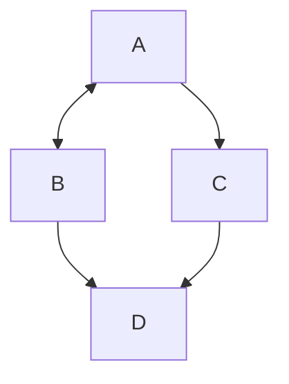

# Git Intro

## References
[Pro Git Book by Scott Chacon and Ben Straub](https://git-scm.com/book/en/v2)  
[A Visual Git Reference by Mark Lodato](https://marklodato.github.io/visual-git-guide/index-en.html)  
[Introduction to Git - Core Concepts by David Mahler](https://youtu.be/uR6G2v_WsRA)  

Git = version control system (VCS).  

## Sample use-cases
* Take snapshots of files over time.  
* Restore earlier versions of files from snapshots.  
* Work on multiple versions of a file in parallel.  

---

## Git commit graph
Git tracks changes to files over time using snapshots that you can take at any time.  
These snapshots are called commits.  
Git commit graph shows the history of commits.

---

## 3  areas of a Git repo

* Working Tree\
What you see on the file system.\
You add, remove, and edit files in the working tree.

* Staging Area (Index)

* History\
Equivalent to the commit graph.  
Kept in a hidden .git directory.  
---
## Create a git repo
1. Create a directory on your file system. This will become git repo's working tree.
    ```
    mkdir myproject
    ```

    Add a file L1 to this directory.
    ```
    Apples
    Oranges
    ```

2. Turn that directory into a git repo using `git init`
    ```
    git init

    Initialized empty Git repository in C:/DATA/Git/myproject/.git/
    ```

3. Note that we haven't made any commit so far. i.e. the file we added to the working tree is untracked and not yet in the staging area.

    Set your username and email before making a commit.  
    List current configuration using `git config`
    ```
    git config --list

    user.name=username
    user.email=email
    ```

    Set your account's default global identity.  
    `--global` means that the provided name and email will be used for any git repo on this system.  
    Use `--local` flag if you wan't to use a different name and email for a particular repo.

    ```
    git config --global user.email "you@example.com"
    git config --global user.name "Your Name"
    ```
---
## Git commit

Use `git status` to view the state of files in the working tree and the staging area.

```
C:\DATA\Git\myproject>git status
On branch master

No commits yet

Untracked files:
  (use "git add <file>..." to include in what will be committed)
        L1.txt

nothing added to commit but untracked files present (use "git add" to track)
```

`git add` - add file to staging area and start tracking the file.\
`git add .` adds all new and modified files to the staging area.
```
C:\DATA\Git\myproject>git add L1.txt

C:\DATA\Git\myproject>git status
On branch master

No commits yet

Changes to be committed:
  (use "git rm --cached <file>..." to unstage)
        new file:   L1.txt
```

`git commit -m "commit message"` - create a commit with whatever is in the staging area.
```
C:\DATA\Git\myproject>git commit -m "add file L1"
[master (root-commit) 97065ac] add file L1
 1 file changed, 2 insertions(+)
 create mode 100644 L1.txt
 ```
 Every commit gets a unique hash value. 97065ac above.

If you just use `git commit` without `-m` option, then it'll open your default text editor where you can provide multi-line comments for the commit. 
```
C:\DATA\Git\myproject>git status
On branch master
nothing to commit, working tree clean
```
---
## Viewing commit graph
`git log` shows commit graph.

```
C:\DATA\Git\myproject>git log
commit 97065ac725e0e6b8687f32747a2bf489c37aa4d8 (HEAD -> master)
Author: Abhinav <agabhinav@users.noreply.github.com>
Date:   Wed Sep 7 15:08:24 2022 -0500

    add file L1
```

Create a new file L2 and edit L1.
```
L2
Apples
Bread
Peaches

L1
Apples
Oranges
Water
```

`git status` shows the following.
```
C:\DATA\Git\myproject>git status
On branch master
Changes not staged for commit:
  (use "git add <file>..." to update what will be committed)
  (use "git restore <file>..." to discard changes in working directory)
        modified:   L1.txt

Untracked files:
  (use "git add <file>..." to include in what will be committed)
        L2.txt

no changes added to commit (use "git add" and/or "git commit -a")
```

`git diff` shows difference between tracked files in the working tree and the staging area.

```
git diff
diff --git a/L1.txt b/L1.txt
index 92e89b1..b8fd882 100644
--- a/L1.txt
+++ b/L1.txt
@@ -1,2 +1,3 @@
 Apples
 Oranges
+Water
\ No newline at end of file
```

```
C:\DATA\Git\myproject>git add .
C:\DATA\Git\myproject>git status
On branch master
Changes to be committed:
  (use "git restore --staged <file>..." to unstage)
        modified:   L1.txt
        new file:   L2.txt
```

`git diff --staged` shows diff between the staging area and the most recent commit. i.e. it shows what we are about to commit.

```
C:\DATA\Git\myproject>git diff --staged
diff --git a/L1.txt b/L1.txt
index 92e89b1..b8fd882 100644
--- a/L1.txt
+++ b/L1.txt
@@ -1,2 +1,3 @@
 Apples
 Oranges
+Water
\ No newline at end of file
diff --git a/L2.txt b/L2.txt
new file mode 100644
index 0000000..58518a5
--- /dev/null
+++ b/L2.txt
@@ -0,0 +1,3 @@
+Apples
+Bread
+Peaches
\ No newline at end of file
```

Commit graph using `git log`
```
C:\DATA\Git\myproject>git log
commit 410cffa1b7c4bfe93bbaf6ccd3488fef2a353da4 (HEAD -> master)
Author: Abhinav <agabhinav@users.noreply.github.com>
Date:   Wed Sep 7 15:36:50 2022 -0500

    add L2 and edit L1

commit 97065ac725e0e6b8687f32747a2bf489c37aa4d8
Author: Abhinav <agabhinav@users.noreply.github.com>
Date:   Wed Sep 7 15:08:24 2022 -0500

    add file L1
```
---
## Remove a file in Git

`git rm <file>` removes the file from the working tree and also stages this removal.

```
C:\DATA\Git\myproject>git rm L2.txt
rm 'L2.txt'

C:\DATA\Git\myproject>git status
On branch master
Changes to be committed:
  (use "git restore --staged <file>..." to unstage)
        deleted:    L2.txt
```

Below is the **commit graph** again after commiting the changes.

```
C:\DATA\Git\myproject>git log
commit dac9d0846f33d8e91e5b5363697626784c4245e0 (HEAD -> master)
Author: Abhinav <agabhinav@users.noreply.github.com>
Date:   Wed Sep 7 15:51:29 2022 -0500

    Delete L2

commit 410cffa1b7c4bfe93bbaf6ccd3488fef2a353da4
Author: Abhinav <agabhinav@users.noreply.github.com>
Date:   Wed Sep 7 15:36:50 2022 -0500

    add L2 and edit L1

commit 97065ac725e0e6b8687f32747a2bf489c37aa4d8
Author: Abhinav <agabhinav@users.noreply.github.com>
Date:   Wed Sep 7 15:08:24 2022 -0500

    add file L1
```

---

## Undo working tree changes
Make some changes to L1.
```
Apples
Oranges
Water
bad data 1
bad data 2
```

`git checkout -- file` replaces the file in working tree with the previous version of the file from staging area, effectively discarding
the new working tree changes.\
`git restore <file>` does the same thing.

---

## Undo staging of files
Edit L1 and stage the change using `git add`
```
Apples
Oranges
Water
more bad data
```

```
C:\DATA\Git\myproject>git add L1.txt

C:\DATA\Git\myproject>git diff

C:\DATA\Git\myproject>git diff --staged
diff --git a/L1.txt b/L1.txt
index b8fd882..34fc5d3 100644
--- a/L1.txt
+++ b/L1.txt
@@ -1,3 +1,4 @@
 Apples
 Oranges
-Water
\ No newline at end of file
+Water
+more bad data
```

`git restore --staged <file>`\
`git reset HEAD <file>` does the same thing. i.e. it restores `<file>` from the latest commit. HEAD refers to the most recent commit.

```
C:\DATA\Git\myproject>git restore L1.txt

C:\DATA\Git\myproject>git diff

C:\DATA\Git\myproject>git status
On branch master
nothing to commit, working tree clean
```

---

## Restore file from an earlier commit

`git checkout <commit-hash> -- <file>` restores the file from a specific commit into both the working tree and the staging area.

```
C:\DATA\Git\myproject>git log -- L2.txt
commit dac9d0846f33d8e91e5b5363697626784c4245e0 (HEAD -> master)
Author: Abhinav <agabhinav@users.noreply.github.com>
Date:   Wed Sep 7 15:51:29 2022 -0500

    Delete L2

commit 410cffa1b7c4bfe93bbaf6ccd3488fef2a353da4
Author: Abhinav <agabhinav@users.noreply.github.com>
Date:   Wed Sep 7 15:36:50 2022 -0500

    add L2 and edit L1

C:\DATA\Git\myproject>git checkout 410cff -- L2.txt

C:\DATA\Git\myproject>git status
On branch master
Changes to be committed:
  (use "git restore --staged <file>..." to unstage)
        new file:   L2.txt

C:\DATA\Git\myproject>git commit -m "restore L2.txt"
[master 85ec248] restore L2.txt
 1 file changed, 3 insertions(+)
 create mode 100644 L2.txt
```
---

## .gitignore

Create a `.gitignore` file in your git repo to specify the files you don't want git to track such as log files etc.

```
/c/DATA/Git/myproject (master)
$ touch myapp.tmp
$ mkdir logs
$ touch logs/log1.log
$ touch logs/log2.log

$ git status
On branch master
Untracked files:
  (use "git add <file>..." to include in what will be committed)
        logs/
        myapp.tmp

nothing added to commit but untracked files present (use "git add" to track)
```
If you don't want git to pay attention to these files,  create a `.gitignore` file.

```
*.tmp
logs/
```

Now, `git status` shows the following. Git is no longer tracking the files specified in `.gitignore` file.

```
$ git status
On branch master
Untracked files:
  (use "git add <file>..." to include in what will be committed)
        .gitignore

nothing added to commit but untracked files present (use "git add" to track)
```



